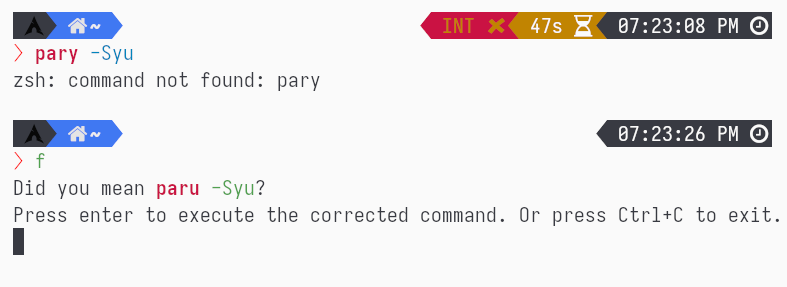
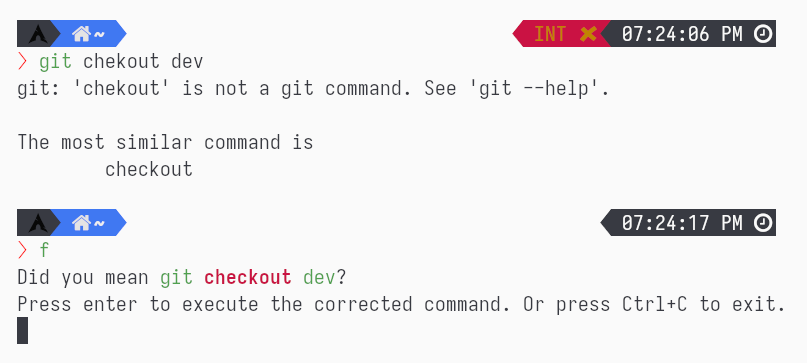

# Pay Respects

Typed a wrong command? Pay Respects will try to correct your wrong console command simply by pressing `F`!






## How to Pay Respects

The binary is named `pay-respects`, by adding an alias to your shell
configuration:
``` shell
# Note: You may need to have the binary exposed in your path
alias f="$(pay_respects <your_shell_here>)"

# for example, using `zsh`:
alias f="$(pay_respects zsh)"

# for `nushell`, the alias can be added automatically with:
pay_respects nushell
```
You can now **press `F` to Pay Respects**!

Currently, only corrections to `bash`, `zsh`, and `fish` are working flawlessly.

`nushell` has broken aliases, therefore it has following 2 limitations:

- You have to manually add the output of `pay_respects nushell` to your configuration as alias
- Aliased commands cannot be expanded to their original command

## Installing

If you are using Arch Linux, you can install from AUR directly:
```shell
paru -S pay_respects
```

Otherwise, you can use cargo to compile the project:
```
cargo build --release
```
and the binary can be found at `target/release/pay_respects`.

## Rule Files

Rule files are parsed at compilation. What actually gets compiled is a HashMap that contains patterns and suggestions for a specific command.

Syntax of a rule file (placed under [rules](./rules)):
```toml
# this field should be the name of the command
command = "world"

# you can add as many `[[match_err]]` section as you want
[[match_err]]
# the suggestion of this section will be used for the following patterns of the error output
# note that the error is formatted to lowercase without extra spaces
pattern = [
	"pattern 1",
	"pattern 2",
]
# this will change the first argument to `fix`, while keeping the rest intact
suggest = "{{command[0]}} fix {{command[2:]}}"

[[match_err]]
pattern = [
	"pattern 1",
]
# this will add a `sudo` before the command if:
# - the `sudo` is found by `which`
# - the last command does not contain `sudo`
suggest = '''
#[executable(sudo), !cmd_contains(sudo)]
sudo {{command}}'''
```

The placeholder is evaluated as following:

- `{{command}}`: All the command without any modification
- `{{command[1]}}`: The first argument of the command (the command itself has index of 0)
- `{{command[2:5]}}`: The second to fifth arguments. If any of the side is not specified, them it defaults to the start (if it is left) or the end (if it is right).
- `{{typo[2](fix1, fix2)}}`: This will try to change the second argument to candidates in the parenthesis. The argument in parentheses must have at least 2 values. Single arguments are reserved for specific matches, for instance, `path` to search all commands found in the `$PATH` environment.
- `{{opt::<Regular Expression>}}`: Optional patterns that are found in the command with RegEx (see RegEx crate for syntax). Note that all patterns matching this placeholder will not take a place when indexing.

The suggestion can have additional conditions to check. To specify the conditions, add a `#[...]` at the first line (just like derive macros in Rust). Available conditions:

- `executable`: Check if the argument can be found by `which`
- `cmd_contains`: Check if the last user input contains the argument
- `err_contains`: Check if the error of the command contains the argument


## Current Progress

We need more rule files!

