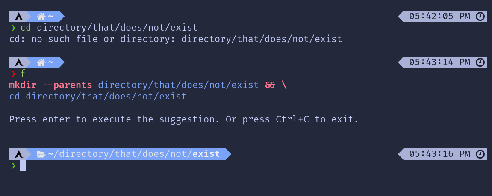

# Pay Respects

Typed a wrong command or don't know what to do? Pay Respects will suggest a fix to your console command by simply pressing `F`!

- 🚀 **Blazing fast suggestion**: You won't notice any delay for asking suggestions!
- ✏️ **Easy to write rules**: You don't need to know Rust. The rules are written in a TOML file!
- 🎯 **Accurate results**: Suggestions are verified before being prompted to the user, no `sudo` suggestions when you are using `doas`!
- 🤖 **AI Support**: AI comes in aid when there is no rule for your error!
- 🪶 **Tiny binary size**: Not even 1MB! Approximately 1MB with all optional features!




## How to Pay Respects

Please follow the instruction for your shell:

<details>
	<summary>Bash / Zsh / Fish</summary>

> Auto aliasing (optional custom alias can be added after `--alias`):
> ```shell
> eval "$(pay-respects bash --alias)"
> eval "$(pay-respects zsh --alias)"
> pay-respects fish --alias | source
> ```
> Additional arguments:
> - `--nocnf`: Disables `command_not_found` handler

> Manual aliasing (**deprecated**, do not use):
> ```shell
> alias f="$(pay-respects bash)"
> alias f="$(pay-respects zsh)"
> alias f="$(pay-respects fish)"
> ```

</details>

<details>
	<summary>Nushell</summary>

> Add the following output to your configuration file:
> ```shell
> pay-respects nushell [--alias <alias>]
> ```

> Or save it as a file:
> ```shell
> pay-respects nushell [--alias <alias>] | save -f ~/.pay-respects.nu
> ```
> and source from your config file:
> ```shell
> source ~/.pay-respects.nu
> ```

</details>

<details>
	<summary>Custom initialization for arbitrary shell</summary>

> pay-respects only requires 2 environment variables to function:
>
> - `_PR_SHELL`: The binary name of the current working shell.
> - `_PR_LAST_COMMAND`: The last command.
>
> pay-respects echos back, if applicable, a `cd` command that can be evaluated by the current working shell.

> General example:
> ```shell
> eval $(_PR_SHELL=sh _PR_LAST_COMMAND="git comit" pay-respects)
> ```

</details>

You can now **press `F` to Pay Respects**!

## Installing

Install from your package manager if available:

[](https://repology.org/project/pay-respects/versions)

For Arch Linux / Arch Linux ARM users, you can install from [Arch Linux CN Repository](https://github.com/archlinuxcn/repo):

```shell
sudo pacman -S pay-respects
```

Or install compiled binaries from [GitHub releases](https://github.com/iffse/pay-respects/releases) with the install script:
```
curl -sSfL https://raw.githubusercontent.com/iffse/pay-respects/main/install.sh | sh
```

<details>
	<summary>Compile from source (any OS/architecture)</summary>

> This installation requires you to have Cargo (the Rust package manager) installed.

> Install from [crates.io](https://crates.io/), features are optional
> ```shell
> cargo install pay-respects --all-features
> ```

> Clone from git and install, suitable for adding custom compile-time rules:
> ```
> git clone --depth 1 https://github.com/iffse/pay-respects
> cd pay-respects
> cargo install --path .
> ```

> Features:
>
> - `runtime-rules`: Read rules in runtime
> - `request-ai`: Request AI for suggestion
> - `libcurl`: Dynamically link `libcurl` for requests, which requires openssl at compile time
> 	- Only matters to package maintainers, as by turning it off gives fewer headaches when cross-compiling


</details>

## Rule Files

See [writing rules](./rules.md) for how to write rules.

## AI Integration

> **Disclaimer**: You are using AI generated content on your own risk. Please double-check its suggestions before accepting.

AI suggestions should work out of the box unless rate limit has reached. Bring your own API keys to avoid it.

If it's useful to you, **please share this project and spread the word**. Also consider making a donation to keep its public usage alive:

<div>
	<a
		href="https://liberapay.com/iff/donate"
		target="_blank"
		rel="noreferrer"
		></a
	>
	<a href="https://ko-fi.com/iffse" target="_blank" rel="noreferrer"
		></a
	>
	<br />
	<a href="https://iffse.eu.org/stripe" target="_blank" rel="noreferrer"
		></a
	>
	<a
		href="https://www.paypal.com/donate/?hosted_button_id=QN7Z7ZHRAAFZL"
		target="_blank"
		rel="noreferrer"
		></a
	>
</div>

<details>
	<summary>AI and API Configuration</summary>

> Configuration is done via environment variables:
>
> - `_PR_AI_API_KEY`: Your own API key
> - `_PR_AI_URL`: URL used. Defaults to `https://api.groq.com/openai/v1/chat/completions`
> - `_PR_AI_MODEL`: Model used. Defaults to `llama3-8b-8192`
> - `_PR_AI_DISABLE`: Setting to any value disables AI integration
> - `_PR_AI_LOCALE`: Locale in which the AI explains the suggestion. Defaults to user system locale

> Compile time variables:
>
> - `_DEF_PR_AI_API_KEY`: Default API key, included in compile-time
>
> </details>

## Contributing

Current option to write rules should cover most of the cases.

We need more rule files, contributions are welcomed!

This project is hosted at various sites, choose the one that suits you best:

- [Codeberg](https://codeberg.org/iff/pay-respects)
- [GitHub](https://github.com/iffse/pay-respects)
- [GitLab](https://gitlab.com/iffse/pay-respects)

